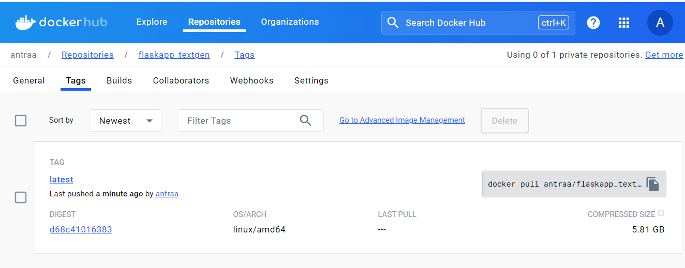
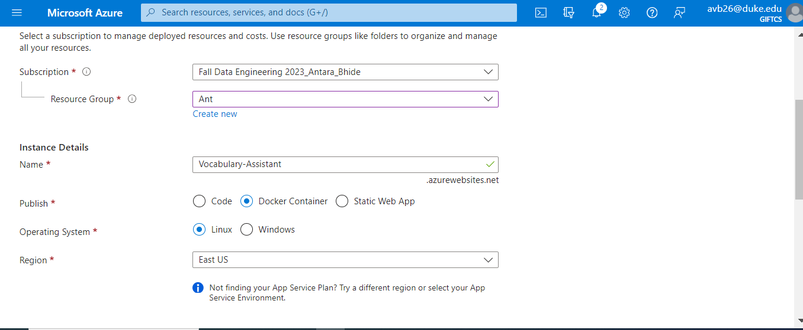
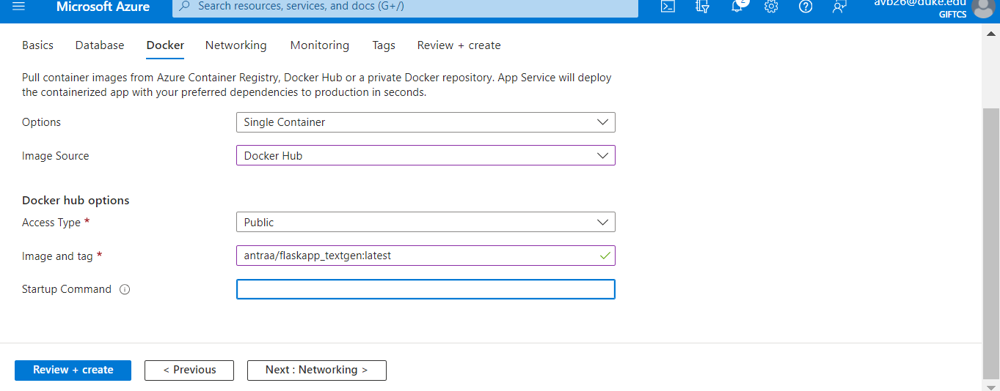
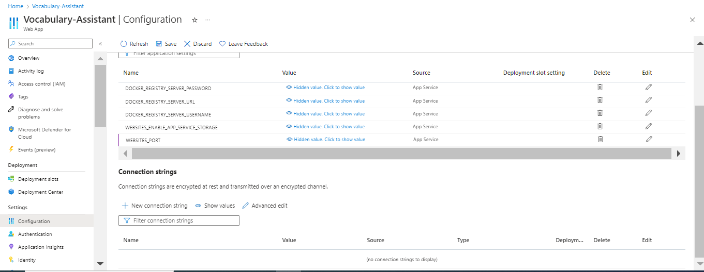
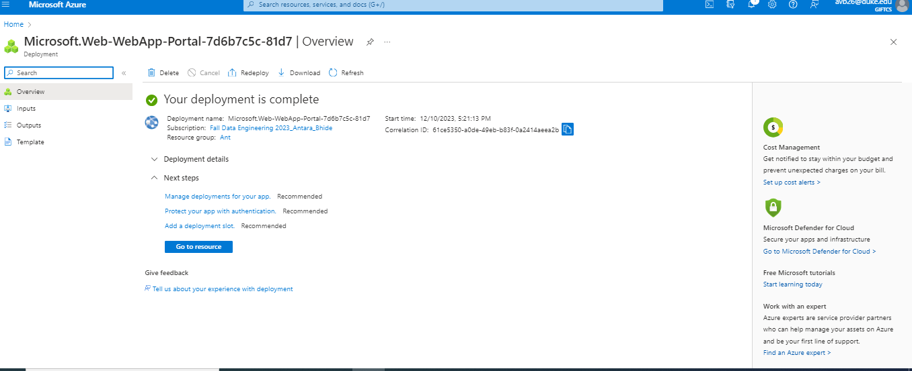

# IDS-706_Individual_Proj4

The purpose of this project is to create an Auto Scaling Flask App Using Any Platform As a Service. 
My application is a vocabulary assistant that takes any word that the user wants to learn to use in a sentence and generates a sentemce to show the user the context in which the word is used. 

1) ## Dockerhub Tag

We create an image of our dockerfile and push it to dockerhub.

2) ## Azure Web App

In the the basics section, I add my details and provide a name for my app.

In the docker section I add the image and tag

In the application settins, I assign the value '5000' to WEBSITE_PORT

3) ## Hosting the Site
The site has been successfully hosted

